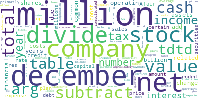
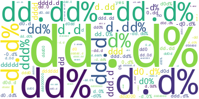

# Financial Data Bot: Report

Author: Daniel Winterstein   

Gen AI was used in writing the code and this report, via the cursor.com editor.

## Overview

This mini project does proof of concept exploration for a financial Q&A data bot.

We find that human-level performance is feasible, with a GPT-4o-mini model achieving 85% accuracy, vs a human expert level of 89% -- and with room to improve the performance score.

With further development, we could reasonably aim for performance at or beyond human expert level.

However not all the experiments produced such strong results. This shows the need for further work to understand failure modes, and for robust and reliable evaluation methods.

### Constraints

Time: This is a mini project, targeting just 4 work hours!

Budget: None!   

Some Azure credit was used to run the experiments.    
A batch-size of 200 was used for the experiments to reduce costs and speed-up the work.

## Method

1. Explore the ConvFinQA repository and the dataset:
   - Understand the schemas
   - Check the word-frequency distributions
   - Check the format of the answers
2. Develop a simple evaluation rig
3. Evaluate a simple LLM-based approach
4. Test a couple of variations
   - Record experiment runs in eval.csv
   - Record correct and incorrect answers for each experiment to allow later analysis
   - Trace calls in LangSmith for cost tracking
5. Explore the pattern of correct and incorrect answers.
6. Write up with notes for future work

## ConvFinQA -Repository Analysis

### data/	The Dataset

	dev.json: 421 entries
	dev_turn.json: 1490 entries
	train_turn.json: 11104 entries
	train.json: 3037 entries
	test_turn_private.json: 1521 entries
	test_private.json: 434 entries

Checking word-frequency counts by eye via word-clouds, the files appear to be drawn from the same underlying distribution.

This could be checked more rigorously by computing the probability they are drawn from the same / different
 distribution using a Bayesian Dirichlet prior.

Word frequency distribution for the dev.json file.

Word frequency distribution for the train.json file.

The _turn files split each entry into a sequence of Q&A interactions, where later questions may rely on previous Q&A for context.

The test_private files do not have the question field. 

#### Rounding and Flexible % Matching for Better Evaluation

Answers are given to zero, one, or two decimal places. Financial units (£, $,, etc) are never included, but % signs are. However this is not consistent: mostly % signs are included where relevant, but sometimes not.
There is not an obvious pattern to the number of decimal places or significant figures. The matter is not mentioned in the Chen et al 2022 paper.

Answer format frequency distribution.

This can lead to false negatives in evaluation. 

For example, 
in `id:Single_RSG/2008/page_114.pdf-2` the target is "1.3%", and a gpt-4o GenAI returned the (more accurate) "1.27%". There is no reason to choose 1.3% over 1.27% in this example. The context for this example did not mention decimal places, and numbers in the context are given to one or two decimal places. 

So: To avoid this distorting results, we apply rounding to two significant figures before comparison, and we ignore % signs, with an allowance for interpreting a missing % sign so that "10%" can match either "10" or "0.1".

### code/	ConvFinQA Code (not used in this project)

Bit-rot level: Medium

The ConvFinQA run instructions in README.original.md are not correct and the code does not run without edits. There are lots of uses of hard-coded developer-specific file-paths, and the data causes bugs in places (e.g. 'gold_ind' is expected but not defined for some data). The ConvFinQA code is not well-commented. It uses what are now out of date LLMs.

Conclusion: Use the dataset, but leave the ConvFinQA code in the past.

## Q&A Evaluation Results

| Q&A Format    | LLM          | Comparison       | Score  | 95% Confidence Interval |
|---------------|--------------|------------------|--------|-------------------------|
| 1-qa          | gpt-4o-mini  | flexible         | 46.0%  | 39% - 53%               |
| 1-qa          | gpt-4o       | flexible         | 63.5%  | 57% - 70%               |
| 1-qa          | gpt-4o-mini  | raw              | 13.0%  | 8% - 18%                |
| 1-qa          | gpt-4o-mini  | extra-flexible   | 61.25% | 54% - 68%               |
| chat-turns    | gpt-4o-mini  | flexible         | 85.5%  | 81% - 90%               |

Note: Confidence intervals could be reduced by running larger batch-sizes. Only part of the data was used for cost reasons.

*GPT 4o out performs GPT 4o-mini: 63.5% vs 46%*
This is not surprising: GPT 4o is the larger model.

*Flexible matching (allowing for % handling and rounding choices) is important for evaluation.*
Evals using raw string comparison gave: 13% accuracy vs 46% accuracy with flexible matching.
This is partly a weakness of the dataset: The precision and format of the answers is not specified and varies between entries. The dataset could be improved to address this, in which case the use of raw string comparison should then give similar results to flexible matching.

*Performance with a conversational series of Q&A turns is substantially better than with a single-turn Q&A: 85.5% vs 46%*
This is in contrast to the Chen et al 2022 paper, where they found a conversational series of Q&A turns was a challenge for the BERT-series LLMs of that time. This is an example of how LLMs have improved.

Why does the conversational Q&A perform better?
 - This might be because the turns evaluation begins with questions that are more likely to be answered correctly, and so the model has a higher baseline accuracy.
 - Or it might be because the conversational flow helps steer the model's state in the right direction for later questions.
 - The chat history may help the model to fit the rounding to the significant figures of the target answer, hence reducing those differences.

### Exploring the correct and incorrect answers

The pattern of correct and incorrect answers is informative. My evaluation code collected the correct and incorrect answers, and saved them to files. These were then analyzed by eye and by passing files into ChatGPT for a comparative analysis.

Several distinct types of error can be seen:

1. Direction of Change Misinterpretation.   
	Errors where positive values are generated for negative changes and vice versa. For instance, a target answer of "-36%" was generated as it's opposite "64%". Some of these might be due to ambiguity in the question.
   
2. Minor differences - reported as errors, but which be rounding issues.   
   In some cases, the errors are a minor difference, (e.g. "61.5%" vs. "61.54%" (entry-id: Double_AWK/2015/page_106.pdf)). This could be due to vagueness in the question, or to rounding during calculations, either by the Gen AI system or in the target answer. These could be improved with a clean-up of the dataset to more precisely specify the target answer.Increasing the tolerance for differences by using 1-significant-figure matching produced an increase in answer matching from 46% to 61%. This strongly suggests that rounding choices are a significant source of reported errors. 

3. Scale mismatch - reported as errors, but which may be ambiguity in the context / question. For example, a target answer of "17.8" was generated as "17800". In this example (entry-id: Single_ETR/2017/page_441.pdf-4_0), the source data was given in a mix of thousands and millions. A better answer would be to return "17.8 million" -- although this would be counted as an error with the current evaluation method.

4. Outright mistakes. These deserve further investigation.

### Costs

Variations tested: 5

Total tokens used in testing: 1,540,181

Total cost: $2.99

### Chen et al 2022: 69% accuracy

The Chen et al 2022 paper uses a structured two-stage approach of: select-relevant-facts, then generate-maths-pseudocode.
This was tested with several BERT-series LLMs. The best performing was Roberta-large, with 69% accuracy.

Chen et al also tested human experts and laymen on the task. The human experts scored 89%.

## Future Work

This mini project has shown that human-level performance is feasible. 

Some issues were found in the dataset, and addressing these would improve the evaluation and the systems developed.

Due to the limited time, it leaves open questions:

 - Why did the conversational Q&A perform so much better?
   - Would a single-turn Q&A perform as well, if the outputs were changed to include producing intermediate steps?

 - How best to provide interpretable and auditable results? Potentially by changing the prompt to include a request for a step-by-step solution.

 - How to handle ambiguity in the context / question? 

 - Are there patterns to the correct and incorrect items? This could guide improvements.

 - How much better can we get with prompt engineering?

 - What performance can we get with other LLM models?
  
 - How much better can we get with fine-tuning?

Another line of work might be using distillation to reduce the size of the model, and hence the cost. 
For most financial applications, accuracy is more important than cost, so this is probably not a priority.
However reducing cost-per-answer would be important if, for example, a freemium B2C product was being built.

